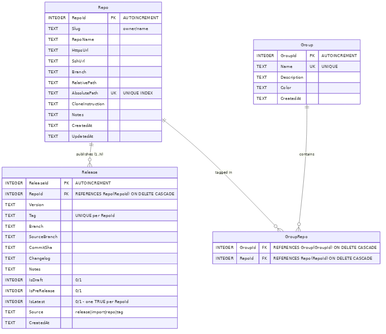

# Release ↔ Repo Relationship

> **Related specs:**
> - [10-database.md](10-database.md) — base SQLite schema conventions
> - [22-data-folder-deploy-and-cleanup.md](22-data-folder-deploy-and-cleanup.md) — DB lifecycle
> - [../07-generic-release/](../07-generic-release/) — release pipeline that produces these rows

## ER Diagram



> Source: [`images/release-repo-er.mmd`](images/release-repo-er.mmd)

## Problem

Until v3.16.x the `Release` table was **orphaned** — no foreign key tied a
release row to the repository it belonged to. This worked while gitmap held
exactly one repo per database, but it broke three properties we rely on:

1. **Referential integrity** — a release row could survive its repo being
   removed from the `Repo` table.
2. **Discoverability** — `SELECT … FROM Release JOIN Repo …` was impossible
   without re-deriving the join key from `AbsolutePath` heuristics.
3. **Future multi-repo support** — even though v3.17.0 keeps the
   single-repo-per-DB model, the schema must be ready for a future
   batch-mode that holds many repos in one DB.

## Resolution (v3.17.0)

`Release` gains a non-null `RepoId INTEGER` column with a hard foreign key
to `Repo(RepoId) ON DELETE CASCADE`. Every release row is now anchored to
exactly one repo. If the repo row is deleted, its releases go with it —
this is the desired behaviour because release metadata is meaningless
without the source repo.

### Schema (post-migration)

```sql
CREATE TABLE IF NOT EXISTS Release (
    ReleaseId    INTEGER PRIMARY KEY AUTOINCREMENT,
    RepoId       INTEGER NOT NULL REFERENCES Repo(RepoId) ON DELETE CASCADE,
    Version      TEXT NOT NULL,
    Tag          TEXT NOT NULL,
    Branch       TEXT NOT NULL,
    SourceBranch TEXT NOT NULL,
    CommitSha    TEXT NOT NULL,
    Changelog    TEXT DEFAULT '',
    Notes        TEXT DEFAULT '',
    IsDraft      INTEGER DEFAULT 0,
    IsPreRelease INTEGER DEFAULT 0,
    IsLatest     INTEGER DEFAULT 0,
    Source       TEXT DEFAULT 'release',
    CreatedAt    TEXT DEFAULT CURRENT_TIMESTAMP,
    UNIQUE (RepoId, Tag)
);
CREATE INDEX IF NOT EXISTS IdxRelease_RepoId ON Release(RepoId);
```

Note that the previous `Tag UNIQUE` global constraint is replaced by a
**composite** `UNIQUE (RepoId, Tag)`. Two different repos could legitimately
both ship a `v1.0.0` tag.

## RepoId resolution

When `UpsertRelease` is called, the caller MUST provide a `RepoId`. The
canonical resolution path is:

1. Read the current working directory (the repo being released).
2. `db.FindByPath(absPath)` returns the matching `Repo` row.
3. Use `Repo.RepoId` as the FK value.
4. If no row matches (the repo has never been scanned), the release write
   **fails loudly** with a clear message instructing the user to run
   `gitmap scan` first. We do NOT auto-create a stub `Repo` row — release
   metadata without proper repo identity is worse than no row at all.

## Migration strategy (Phase 6)

The migration is **destructive by design**. The user-approved policy:

> **Wipe + rebuild from `.gitmap/release/`**

Rationale: existing `Release` rows have no way to recover their owning
`RepoId` short of fragile path-heuristic guessing. Since the canonical
source-of-truth (`.gitmap/release/v*.json`) is preserved on disk, we can
safely drop and re-import.

### Migration steps (`migrateV15Phase6`)

1. **Detect**: if `Release` table exists AND lacks `RepoId` column, proceed.
2. **Warn**: print to `os.Stderr`:
   ```
   → Migrating Release table: adding RepoId FK to Repo
   → Existing Release rows will be wiped and re-imported on next
     `gitmap list-releases` or `gitmap scan-import`.
   ```
3. **Drop** the `Release` table entirely (`DROP TABLE Release`).
4. The standard CREATE pass that runs immediately after Phase 6 will
   recreate `Release` with the new schema (including `RepoId` FK).
5. Next `gitmap list-releases` invocation calls `loadReleasesFromRepo()`
   which reads `.gitmap/release/v*.json` and re-populates the table.

### Why not "leave NULL, fill on next write"?

We considered making `RepoId` nullable so existing rows could be retained
without a backfill. We rejected this because:

- Nullable FKs defeat the entire point of the relationship — we'd still
  have orphan rows.
- The composite `UNIQUE (RepoId, Tag)` constraint cannot be satisfied
  with NULL `RepoId` values without surprising semantics.
- Disk-based release metadata is the canonical source-of-truth. The DB
  is a queryable cache. Wiping a cache is cheap.

## Multi-repo scope (v3.17.0 vs future)

Each gitmap database still tracks **one repo's releases at a time** — the
repo whose working directory the binary was invoked from. The `RepoId` FK
is added for relational correctness, not because list/upsert queries
filter by it today.

**However**, the schema now permits a future `gitmap releases --all-repos`
batch view that holds rows for multiple repos in the same DB without
requiring another schema break. The `IdxRelease_RepoId` index pre-pays
for that filter.

## Risk register

| Risk | Mitigation |
|------|------------|
| User has `Release` rows but no `.gitmap/release/` files | Lost. Documented in CHANGELOG breaking-change note. Recovery: `gitmap release-import --from-github` (existing command). |
| Concurrent `gitmap` process holds DB lock during migration | Existing `gitmap.lock` advisory lock blocks concurrent writers. |
| Repo not yet scanned when first release fires | UpsertRelease returns a clear error: "run `gitmap scan` first". Aborts cleanly. |

## Contributors

- [**Md. Alim Ul Karim**](https://www.linkedin.com/in/alimkarim) — Creator & Lead Architect.
- [Riseup Asia LLC](https://riseup-asia.com) (2026)
